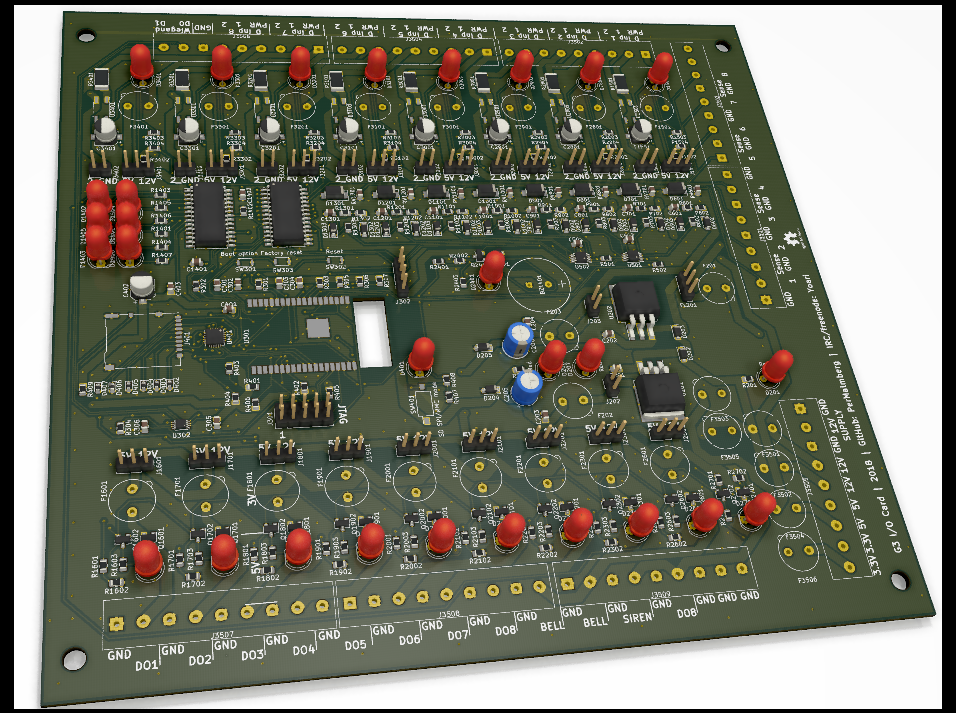

# IO-Card G3

This is my custom I/O card, third generation. Main purpose is to serve as an alarm system.

## Hardware features

- 8 analog inputs for detecting changes in resistance (a.k.a balanced line).
- 8 digital inputs, 3.3-24V
- 8 digital outputs, 5/12V, fused.
- 6 controllable status LED.
- Optional BME280
- Wiegand interface
- On-board buzzer.
- SD Card (SPI and MMC bus selectable)
- JTAG debugging (when SD Card is using SPI)
- LED indicators for all input and outputs.
- Screw terminals for all interfaces.
- MCU: ESP32 Wrover Module
- Powered by 12V DC.

## Software

- Web interface for configuration and status monitoring.
- MQTT for control and monitoring.

### Software overview

#### Feature specification / task list

- NTP
  Based on config, synchronize clock with NTP server every 15 minutes.
- I2C
  - On interrupt on `ANALOG_RDY_1` or `ANALOG_RDY_2`, read analog values; publish internally.
  - On interrupt on `DIA_Interrupt`, read digital input values; publish internally.
  - Periodically read BME280 values and publish internally (&lt;id&gt;/io/status/sensor)
  - Receive control events and set digital outputs accordingly.
    - Also handle `SIREN_CTRL`, even though it is not on the I2C bus.
- MQTT
  - All payloads must be JSON-formated.
  - Periodically publish all I/O statuses on the following topics:
    - `<ID>`/io/status/digital/input/&lt;number&gt;
    - `<ID>`/io/status/digital/output/&lt;number&gt;
    - `<ID>`/io/status/analog/input/&lt;number&gt;
    - `<ID>`/io/status/buzzer
    - `<ID>`/io/status/siren
    - Publish Wiegand button sequences on topic `<ID>`/io/status/wiegand
    - If enabled in configuration, allow I/O to be controlled via topic `<ID>/io/set/channel_no`, where `channel_no` is a number between 1 and 8.
  - All published items shall have an `age` value which tells how long has passed since the value was last updated from the actual I/O.
  - All published items shall have a `unix_timestamp` value which tells when the item was created.
  - a value of `true` shall be interpreted as 'active', regardless if the input/output is active high or low. i.e. if the buzzer is making sounds, the the status is `true`.
  - All topics can be renamed via configuration.
    - The special string `@ID@` is used to signify the ID of the device. Any instance of it in the replacement topic will be replaced with the device ID.
    - Once a topic is renamed, the original one ceases to function until the renaming is removed from the configuration.
- Wiegand
  - Listen to button presses and publish internally.  
  - Each series must end with the `execute_button` button, usually '#' (but as its numerical button value). Any press on the `cancel_button` (*) clears any already entered numbers from the buffer.
  - If no input is received during `entry_timeout` milliseconds, the bufer is cleared and no number series is published.
- Alarm
  - Based on configuration, do:
    - Play sound using the buzzer when any armed I/O with an `entry_delay` larger than 0 changes state, for the duration of the delay.
    - Sound siren for X minutes when any input marked as `armed` no longer matches its configured `armed_state`. For analog inputs this means a value outside the range of `value` +/- `allowed_hysteresis`.
      - Delay for the configured `entry_delay` if the triggering input has one larger than 0. Immediately sound the siren if an input other than the first is triggered during the wait time.
    - Silence siren after X minutes, regardless if an IO marked as `armed` has returned to its `armed_state` or not.
      - Do not sound the siren again until after Y minutes.
    - Based on configuration, allow inputs to be grouped into 'zones' so that two or more inputs can be (un)marked as `armed` with a single command.
      - MQTT topic: `<ID>/alarm/zone/set/<zone_name>`, with a payload of `true` or `false`.
      - Wiegand: A series of digits (i.e. a code) can via configuration be associated to a 'zone'. Each entry of the code toggles the `armed` marker for all inputs in that zone. 
    - Whenever an input or zone is armed/disarmed, play a distict sound using the buzzer to signify the event.
    - Whenever the last input has its `armed` mark removed, play a distict sound to signify that the alarm now is 'off'.
    - Inputs with `active` set to `false` are never considered for any operation.

#### Startup procedure

- Initialize I2C Bus.
  - 2x MCP23017
  - 2x ADS1115IDGST
  - Optional BME280.
- Read `SD_ENABLE` to determine the mode for the SD Card.
  - Initialize SD Card.
    - If initialization fails, pause for a short amount of time and retry X times.
    - If initialization fails Y times, power cycle SD Card and try again.
- Read device `ID` from configuration.
  - If not set, generate a random number and set `ID` to `IOG3_<number>`.
- Start Wifi
- Start MQTT worker
- Start I2C worker
- Start Wiegand worker
- Start Alarm worker

## Configuration structure/example

```json
{
    "ntp": {
        "servers": ["0.se.pool.ntp.org", "1.se.pool.ntp.org"]
    },
    "i2c":
    {
        "bme280": {
            "enabled": true
        }
    },
    "mqtt": {
        "rename_topic" : {
            "io/status/digital/input/1" : "@ID@/Hallway",
            "io/status/digital/input/2" : "@ID@/FrontDoor"
        }
    },
    "wiegand": {
        "execute_button": 11,
        "cancel_button": 12,
        "entry_timeout": 2000
    },
    "alarm": {
        "output":
        {
            "digital":
            {
            }
        },
        "input":
        {
            "analog":
            {
                "1": {
                    "active": true,
                    "value": 1235,
                    "allowed_hysteresis": 500
                },
                "2": {
                    "active": false,
                    "value": 0,
                    "allowed_hysteresis": 0
                }
            },
            "digital":
            {
                "1": {
                    "active": true,
                    "armed_state": true,
                },
                "2": {
                    "active": true,
                    "armed_state": false,
                    "entry_delay": 30000
                },
                "3": {
                    "active": false,
                    "armed_state": false
                }
            }
        }
    }
}
```

## Rendering of the PCB

(sorry, no 3D models for some components)


